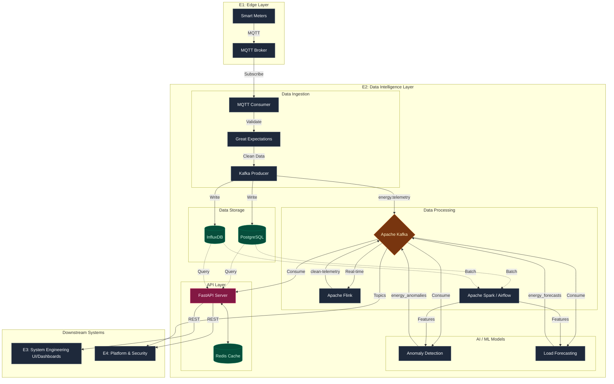

# Subgroup E2 : Data Engineering + AI/ML

---

## Overview
E2 is responsible for the data and intelligence layer of the Energy Management System. We handle data ingestion from smart meters, real time stream processing, batch analytics, ML based load forecasting and anomaly detection, and serving insights via a REST API.

---

## Our Responsibilities
- Kafka based data ingestion from E1 (smart meters via MQTT)
- Real time stream processing with Apache Flink
- Batch analytics pipelines with Apache Spark + Airflow
- Load forecasting model (LSTM/Prophet)
- Anomaly detection for energy theft/leakage (Isolation Forest)
- Data quality validation with Great Expectations
- REST API (FastAPI) serving forecasts, anomalies and recommendations to E3 & E4

---

# System Architecture


---

## Tech Stack
| Area | Tools |
|---|---|
| Ingestion | Apache Kafka, MQTT |
| Stream Processing | Apache Flink |
| Batch Processing | Apache Spark, Apache Airflow |
| ML Models | PyTorch, MLflow |
| API | FastAPI |
| Storage | InfluxDB, PostgreSQL |
| Validation | Great Expectations |
| Containerization | Docker, Docker Compose |
| CI/CD | GitHub Actions |

---

## Project Structure
```
data-intelligence/
├── .github/
│   └── workflows/
│       └── ci.yml                    # GitHub Actions CI pipeline
├── dags/                             # Airflow DAGs (batch pipelines)
│   ├── data-validation-dag.py
│   ├── energy-batch-pipeline.py
│   └── model-retraining-dag.py
├── data/                             # Local sample/mock data
├── db/
│   ├── postgres/                     # Schema + migrations
│   └── influxdb/                     # Bucket configs
├── docker/                           # Per-service Dockerfiles
│   ├── Dockerfile.anomaly
│   ├── Dockerfile.api
│   ├── Dockerfile.forecasting
│   ├── Dockerfile.ingestion
│   └── Dockerfile.streaming
├── mlflow/                           # MLflow experiment tracking config
│   └── config.yaml
├── src/
│   ├── ingestion/                    # Kafka consumers, MQTT bridge
│   ├── streaming/                    # Flink stream processors
│   ├── models/
│   │   ├── forecasting/
│   │   └── anomaly/
│   ├── optimization/                 # Energy optimization recommendations
│   │   └── recommendations.py
│   ├── spark/                        # Spark batch jobs
│   │   ├── batch-energy-analytics.py
│   │   └── feature-engineering.py
│   ├── api/                          # FastAPI app + routes
│   │   ├── routes/
│   │   ├── main.py
│   │   ├── schemas.py
│   │   └── dependencies.py
│   ├── validation/                   # Great Expectations
│   └── utils/
├── tests/
│   ├── fixtures/
│   │   └── energy-readings.json
│   ├── integration/
│   │   ├── test-db-connections.py
│   │   └── test-kafka-pipeline.py
│   ├── system/                       # End-to-end system tests
│   │   ├── test-end-to-end-pipeline.py
│   │   └── test-api-e2e.py
│   └── unit/
│       ├── test-anomaly.py
│       ├── test-api.py
│       ├── test-forecasting.py
│       ├── test-ingestion.py
│       ├── test-streaming.py
│       └── test-validation.py
├── .env.example
├── docker-compose.yml
├── pyproject.toml
├── README.md
└── requirements.txt
```

---

## Getting Started

> **Important:** Before you start working, read the [Contributing Guidelines](CONTRIBUTING.md).

### Prerequisites
- Docker + Docker Compose
- Python 3.11+

### Setup
```bash
git clone https://github.com/Prypiatos/data-intelligence.git
cd data-intelligence
cp .env.example .env
docker-compose up -d
pip install -r requirements.txt
```

### Run Tests
```bash
pytest tests/ -v
```

---

## Related Repositories
- [E1 - Device & Edge Systems](https://github.com/Prypiatos/energy-edge-nodes)
- [E3 - System Engineering & Interaction](https://github.com/Prypiatos/ems-app)
